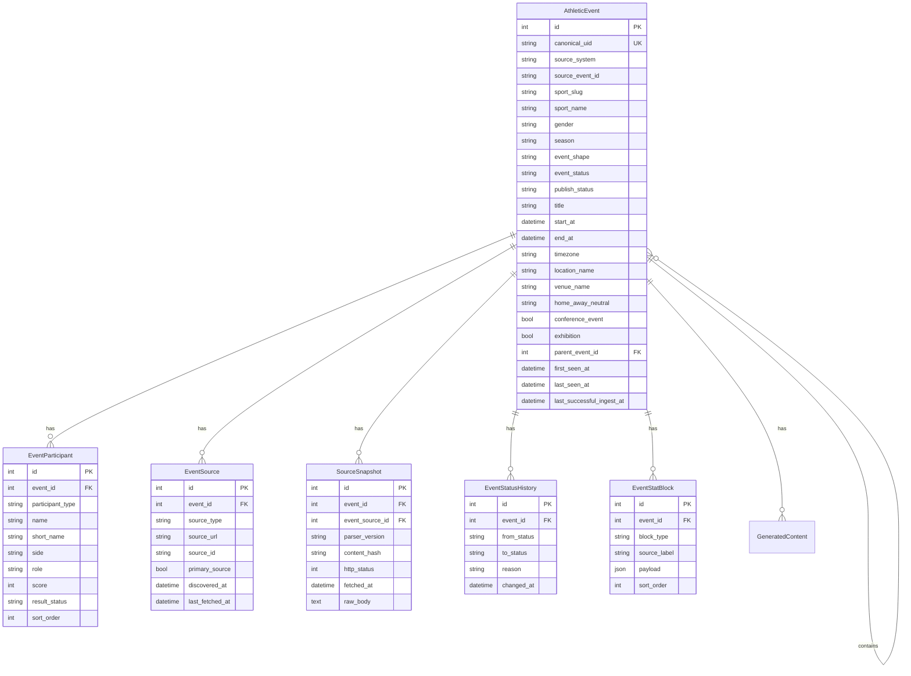

# Athletic Event Model

This design note starts the canonical event-model work called out in
[#14](https://github.com/ui-insight/sidearm-pipeline/issues/14), using the
current University of Idaho athletics website as the first source of truth for
the kinds of events the platform must represent.

## Issue Context

The open issue backlog points to this order of work:

- [#10](https://github.com/ui-insight/sidearm-pipeline/issues/10): inventory
  Release 1 sports and Sidearm source patterns
- [#11](https://github.com/ui-insight/sidearm-pipeline/issues/11): document
  live-data versus final-boxscore behavior by sport
- [#12](https://github.com/ui-insight/sidearm-pipeline/issues/12): add a
  source registry configuration model
- [#13](https://github.com/ui-insight/sidearm-pipeline/issues/13): capture
  representative Sidearm fixtures
- [#14](https://github.com/ui-insight/sidearm-pipeline/issues/14): design the
  canonical event schema and status model
- [#15](https://github.com/ui-insight/sidearm-pipeline/issues/15)-[#17](https://github.com/ui-insight/sidearm-pipeline/issues/17):
  preserve snapshots, support idempotent upserts, and test repeated ingest

The current `games` table is a useful scrape result table, but it is keyed by
`source_url`. The next model needs stable event identity, event status, source
lineage, and update metadata.

## Website Observations

Observed on April 24, 2026 from the public athletics website:

- The main navigation exposes schedules for basketball, cross country,
  football, golf, tennis, track and field, soccer, swimming and diving, and
  volleyball on the [official athletics website](https://govandals.com/).
- University catalog copy describes Idaho as sponsoring 16 intercollegiate
  sports, with men's programs in football, basketball, cross country, indoor
  and outdoor track and field, tennis, and golf; and women's programs in
  basketball, volleyball, cross country, indoor and outdoor track and field,
  tennis, golf, soccer, and swimming and diving.
- Schedule pages use familiar Sidearm structures: sport schedule pages,
  location filters, season selectors, home/away/neutral markers, conference
  flags, recap links, box-score links, live-stat links, game-book PDFs, and
  result links.
- Basketball and soccer schedules show single-opponent contests with scores,
  venues, dates, and box-score/recap links.
- Football schedules show single-opponent contests, but also need football-
  specific fields such as stadium, attendance, duration, period scoring, and
  scoring summaries.
- Swimming and diving schedules include both dual-meet style scores and
  multi-day invitationals/championships with full-results links instead of a
  normal box score.
- Basketball schedules can include named neutral-site events or tournaments
  that group multiple contests under a parent event.

## Supported Event Shapes

The canonical model should represent these shapes without pretending every
sport is a football-style box score.

| Shape | Examples | Model implication |
| --- | --- | --- |
| `team_contest` | football, basketball, soccer, volleyball | Two primary teams, home/away/neutral, score by period/set, final score |
| `team_match` | tennis | Team result plus individual matches; may need nested match results |
| `dual_meet` | swimming and diving duals | Two teams, aggregate score, event-result details may arrive as PDFs or result links |
| `multi_team_meet` | cross country, track and field, swimming invites | Many teams and/or individuals, rankings/results, often no simple home/away score |
| `tournament_event` | basketball classics, golf tournaments, championship meets | Parent event spanning dates, venue, and child contests/rounds/results |
| `exhibition` | basketball or soccer exhibitions | Same structure as a contest, but should not always count toward standings |

## Proposed Core Entities

## Status Vocabulary

Use separate lifecycle and publication status fields. That prevents a final
event from being treated as website-ready before validation passes.

Event lifecycle:

- `scheduled`: listed on a schedule, no live/final result yet
- `pregame`: within a configured pregame window
- `live`: source indicates active competition or active live stats
- `delayed`: known delay before or during the event
- `suspended`: started but paused beyond normal sport breaks
- `final`: source indicates a completed result
- `postponed`: event is moved to a later date
- `canceled`: event will not be played
- `unknown`: source cannot be interpreted confidently

Publish lifecycle:

- `draft`: ingested but not validated
- `blocked`: validation found a publication blocker
- `validated`: eligible for website publication
- `published`: included in the website-facing feed or endpoint
- `errored`: publish attempt failed
- `retracted`: intentionally removed from website-facing output

## Identity Strategy

Canonical identity should be derived in this order:

1. Use a stable Sidearm event or contest id when one exists in schedule,
   box-score, or live-stat links.
2. Otherwise derive a deterministic key from `source_system`, `sport_slug`,
   `season`, normalized start date, home/away/neutral marker, opponent, and
   venue.
3. Store all observed source URLs separately in `event_sources` so a schedule
   URL, live-stat URL, recap URL, box-score URL, and PDF result URL can all
   point at the same event.

`canonical_uid` should be opaque to downstream consumers. Website APIs can
expose it as a stable id, but consumers should not parse business meaning from
it.

## Release 1 Recommendation

For Release 1, model broadly but implement narrowly:

- Keep the current `games` behavior working while adding canonical fields.
- Use `AthleticEvent` as the conceptual target, even if the first migration
  evolves the existing `games` table rather than renaming it immediately.
- Prioritize final-data support for `team_contest` sports first: football,
  men's basketball, women's basketball, soccer, and volleyball.
- Treat tennis, cross country, golf, track and field, and swimming and diving as
  source-inventory and fixture work before promising full normalized result
  rendering.
- Add `event_sources` and `source_snapshots` before idempotent upsert logic so
  parser changes can be replayed safely.

## Open Questions

- Which sports are formally in scope for Release 1 versus inventory-only?
- Should the application table be renamed from `games` to `athletic_events`, or
  should the first release preserve `games` and introduce canonical fields
  there?
- Which Sidearm pages expose reliable machine-readable event ids, and are those
  ids stable across schedule, live-stat, box-score, and recap pages?
- How much raw body retention is acceptable for large schedule/result PDFs or
  HTML snapshots?
- Does the athletics website need parent tournament events in Release 1, or can
  it publish only child contests initially?
