# As-Built Data Model

This document is the authoritative human-readable inventory of the persisted
Vandals Stats Pipeline schema. It describes the SQLAlchemy metadata and Alembic
head at migration `0010_achievement_review_verdicts`.

The executable schema remains defined by `backend/app/models/` and
`backend/migrations/versions/`. Update this page in the same change set whenever
an entity, relationship, classification-relevant field, or migration changes.

## Scope and boundaries

The current schema supports:

- canonical athletic events, source URLs, source snapshots, lifecycle history,
  and durable ingest-run records
- legacy source-shaped boxscore tables retained for API compatibility
- normalized sport, team, player, roster, and external-identity dimensions
- long-form player and team facts at game and season grain
- governed metric semantics, Coverage Windows, and reviewable data-quality issues
- reviewed player-identity resolutions
- shared workspace route/filter definitions
- generated editorial drafts
- versioned Notability policies, deterministic Achievement Suggestions, optional
  AI ranking/phrasing, and SID verdict provenance

The schema does not yet provide generalized participants/results for non-team
contest shapes, scheduled job definitions, immutable operator audit events,
individual user/RBAC tables, or website-syndication records.

## Relationship overview

```mermaid
erDiagram
    SPORT_PROGRAMS ||--o{ STAT_DEFINITIONS : defines
    SPORT_PROGRAMS ||--o{ PLAYER_SEASONS : has
    SPORT_PROGRAMS ||--o{ COVERAGE_WINDOWS : bounds
    SPORT_PROGRAMS ||--o{ DATA_QUALITY_ISSUES : scopes
    SPORT_PROGRAMS ||--o{ NOTABILITY_POLICIES : configures

    TEAMS ||--o{ PLAYER_SEASONS : rosters
    TEAMS ||--o{ OPPONENT_ALIASES : identifies
    PLAYERS ||--o{ PLAYER_EXTERNAL_IDENTITIES : anchors
    PLAYERS ||--o{ PLAYER_SEASONS : participates
    PLAYERS ||--o{ PLAYER_GAME_STATS : records
    PLAYERS ||--o{ PLAYER_IDENTITY_RESOLUTIONS : resolves

    GAMES ||--o{ EVENT_SOURCES : discovers
    GAMES ||--o{ SOURCE_SNAPSHOTS : captures
    GAMES ||--o{ EVENT_STATUS_HISTORY : transitions
    GAMES ||--o{ INGEST_RUNS : processes
    GAMES ||--o{ PLAYER_GAME_STATS : contains
    GAMES ||--o{ TEAM_GAME_STATS : contains
    GAMES ||--o{ ACHIEVEMENT_SUGGESTIONS : produces

    EVENT_SOURCES ||--o{ SOURCE_SNAPSHOTS : yields
    SOURCE_SNAPSHOTS ||--o{ PLAYER_GAME_STATS : supports
    SOURCE_SNAPSHOTS ||--o{ PLAYER_SEASON_STATS : supports
    STAT_DEFINITIONS ||--o{ PLAYER_GAME_STATS : types
    STAT_DEFINITIONS ||--o{ PLAYER_SEASON_STATS : types
    STAT_DEFINITIONS ||--o{ TEAM_GAME_STATS : types
    STAT_DEFINITIONS ||--o{ TEAM_SEASON_STATS : types

    PLAYER_SEASONS ||--o{ PLAYER_SEASON_STATS : contains
    NOTABILITY_POLICIES ||--o{ NOTABILITY_POLICY_METRICS : contains
    NOTABILITY_POLICIES ||--o{ ACHIEVEMENT_SUGGESTIONS : scores
    COVERAGE_WINDOWS ||--o{ ACHIEVEMENT_SUGGESTIONS : qualifies
```

The diagram emphasizes the normalized warehouse. The complete 27-table
inventory follows.

## Canonical events, sources, and operations

### `games`

One canonical athletic event. `source_url` and `canonical_uid` are independently
unique. The record carries source identity, sport/season context, lifecycle and
publish status, two-team summary fields, venue/time metadata, freshness
timestamps, and a compatibility copy of raw HTML.

Current constraints:

- `game_date` remains source text rather than a normalized date/time field.
- The summary shape assumes a two-team contest.
- Publish-state transitions are not enforced by a dedicated validation service.

### `event_sources`

Known schedule, boxscore, recap, live-stat, gamefile, or other source references
for one game. A `(game_id, source_type, source_url)` constraint prevents duplicate
registrations.

### `source_snapshots`

Immutable-at-ingest raw source evidence with source system/type, URL, parser
version, content hash, HTTP status, fetch time, and raw body. A snapshot may be
captured before a game or event-source relationship is known, so those foreign
keys are nullable.

### `event_status_history`

Durable transitions between event lifecycle states, with reason and timestamp.

### `ingest_runs`

One operational execution against a source URL. It records trigger and source
context, status/timing, retry attempts, HTTP result, retryability, error details,
and structured run metadata. Range backfills also use these records for parent
run checkpoints and resumption.

### Legacy boxscore compatibility tables

- `team_stats`: source-shaped home/away team-stat rows.
- `player_stat_groups`: source-shaped player tables stored as JSON columns/rows.
- `scoring_plays`: ordered scoring progression for supported team contests.

These tables preserve the original scrape-store-display contract. New Record
Book and semantic-query work uses normalized fact tables instead of interpreting
`player_stat_groups` at query time.

## Warehouse dimensions and identity

### `sport_programs`

One Idaho sport program, such as women's basketball, with stable slug, display
name, sport, gender, season format, and active state.

### `teams`

Canonical Idaho and opponent team identities. The table stores stable slugs,
canonical/short names, institution, and whether the team is Idaho.

### `opponent_aliases`

Source-specific observed opponent names mapped to canonical teams within a sport
program. This supports labels such as “Idaho State,” “Idaho St.,” and “ISU.”

### `players`

Canonical warehouse person records with display and parsed name fields. A player
is not identified by name alone.

### `player_external_identities`

Namespaced source identities for a canonical player. The uniqueness boundary is
`(source_system, institution, source_player_id)`, preventing a bare Sidearm
numeric identifier from being treated as globally unique. First/last-seen times
and source URL preserve provenance.

### `player_seasons`

Roster membership for a player, sport program, team, and season, including
jersey, class year, position, bio URL, and source snapshot.

### `player_identity_resolutions`

Reviewed fallback matches used when a stable external player identity is missing
or ambiguous. The record preserves its match key, observed source/name/jersey
context, selected canonical player, originating quality issue, notes, and
timestamps.

## Metric semantics and normalized facts

### `stat_definitions`

The governed metric catalog. Each definition belongs to a sport program and
specifies:

- stable key and display label
- entity scope, value type, and unit
- aggregation method and comparison direction
- qualifying minimum and display format
- source field aliases
- ratio numerator/denominator keys when derived from components
- Record Book and Notability eligibility

Editorial weights do not live here; ADR-008 places them in versioned Notability
policy records.

### `player_game_stats`

One numeric player fact for one game and metric. It links to the canonical player,
optional team, metric definition, and source snapshot, while retaining the source
field and original value text.

### `team_game_stats`

The team-grain counterpart to `player_game_stats`, keyed by game, team, metric,
and source snapshot.

### `player_season_stats`

One source-provided or authoritative player-season fact linked through
`player_seasons`, with metric definition and source snapshot.

### `team_season_stats`

One source-provided or authoritative team-season fact linked directly to sport
program, season, team, metric definition, and source snapshot.

Long-form fact tables use `Numeric(18, 6)` values. Valid aggregation depends on
the associated `stat_definitions` record, not on the database column alone.

## Trust, coverage, and editorial records

### `coverage_windows`

The bounded truth context for a sport program, optional metric, grain, and source
system. It stores first/last season, completeness, known limitations, and
verification timestamps. Comparative output must use this context rather than
assuming “all-time” coverage.

### `data_quality_issues`

Reviewable identity, reconciliation, source-conflict, parser, or missing-event
problems. Issues may point to the relevant program, game, player, team, metric,
and source snapshot. Deduplication key, severity, structured details, resolution
notes, and lifecycle timestamps support repeatable triage.

### `notability_policies`

Immutable versioned editorial rubrics per sport program. Each version records a
name, achievement-scope weights, top-N boundary, active flag, and creation time.

### `notability_policy_metrics`

Metric-level importance weights, thresholds, and suppression rules for one
Notability-policy version. This table separates changing editorial preferences
from stable metric semantics.

### `achievement_suggestions`

Persisted comparative facts computed from warehouse history. Each suggestion
links to its game, player, metric, policy version, optional Coverage Window, and
source snapshot. It preserves computed/comparison values, rank, deterministic
score, explanatory and coverage context, optional AI phrasing/ranking provenance,
and the current SID verdict with reviewer and timestamp.

The row stores the current verdict rather than an immutable verdict-event
history. Prior verdict counts used by feedback calibration are captured in each
new suggestion's context; see ADR-009.

### `articles`, `article_achievement_suggestions`, and `evidence_bundles`

An Article begins as SID-authored editorial intent linked to approved Achievement
Suggestions from one game. Its immutable Evidence Bundles preserve the exact facts,
Coverage Windows, verdict metadata, source provenance, and canonical content hash
available to the writer.

### `style_guide_versions`

Immutable editorial policy snapshots with scope, rules, instructions, author, version,
and content hash. Release 1 seeds a shared-athletics version; scoped authoring and
activation are added under issue #148.

### `article_generation_jobs` and `article_versions`

Durable generation jobs persist queued/running/succeeded/failed state, worker lease,
attempt count, exact bounded writer input, resolved Style Guide snapshot, provider
metadata, validation findings, and hashes. A successful safe result creates one
append-only AI Article Version. Failed or unsafe output creates no partial version.

### `generated_content`

Optional AI-generated headline, recap, spotlight, and social-copy drafts for a
game, with model and generation time. These are Internal until explicitly
published elsewhere. This is the legacy ungoverned path retained temporarily for
comparison; it is not used by evidence-bound Article generation.

### `workspace_views`

Deployment-wide named Season-desk or Player-comparison route/filter definitions.
`created_by` is prototype-session context, not an ownership or authorization
boundary. Under the current shared-credential model, every authenticated user can
open and delete every saved view.

## API and derived-result boundaries

Pydantic schemas in `backend/app/schemas/` define transport contracts; they are
not additional persisted entities. Record Book results, semantic-query answers,
pregame briefs, review queues, and CSV exports are computed from the warehouse and
are not stored as separate result tables.

## Known model gaps

- generalized events, participants, placements, rounds, heats, attempts, and
  parent/child tournament structures for non-team-contest sports
- immutable operator and verdict audit-event history
- individual users, institutional SSO, and role-based authorization
- website-syndication publications, versions, and delivery receipts
- automated retention/disposal state for raw snapshots and operational metadata

These are gaps, not implied capabilities. Add them to this inventory only when
the corresponding migration and ORM model land.
