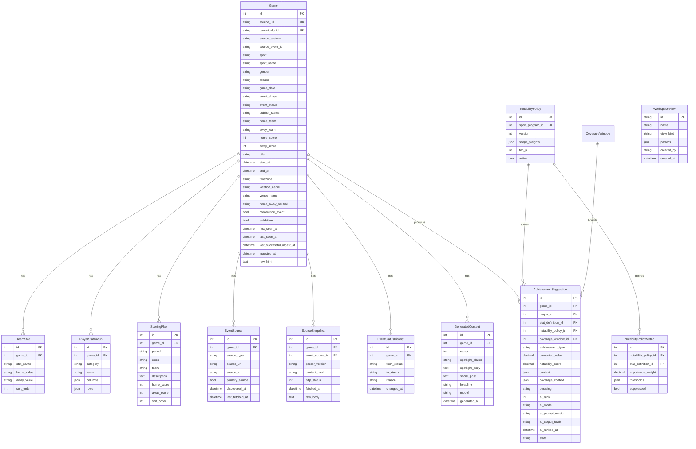

# Data Model

This document describes the current persisted data model for Vandals Stats
Pipeline and highlights the gaps that still need to be addressed as the project
moves from manual ingestion to live website syndication.

## Scope

The current schema supports:

- ingestion of public Sidearm boxscore pages
- canonical event identity and lifecycle metadata for ingested games
- storage of normalized game metadata, team stats, player stat groups, and
  scoring plays
- source URL lineage, raw source snapshots, parser version metadata, and event
  status history
- storage of optional AI-generated coverage derived from a game record
- deployment-wide saved workspace route and filter definitions
- versioned WBB Notability policy, deterministic Achievement Suggestions, and
  validated optional AI ordering and phrasing

The current schema does not yet include ingest job tracking, operator audit logs,
participant tables for non-boxscore event shapes, or website syndication
records. Those capabilities are planned in the roadmap and epics.

## Entity Relationship Overview

## Entities

### `games`

Defined in [backend/app/models/game.py](/Users/barrierobison/Documents/Administration/AICoordination2026/Athleticsdata/sidearm-pipeline/backend/app/models/game.py:17).

Purpose:
- one persisted record per ingested Sidearm event, currently maintained through
  the manual boxscore ingestion path
- anchor entity for normalized event data, source lineage, and generated
  coverage

Important fields:
- `source_url`: current manual-ingest uniqueness boundary
- `canonical_uid`: stable event identity for future idempotent ingest and
  website consumers
- `source_system`, `source_event_id`: external source identity, currently
  derived from Sidearm boxscore URLs when available
- `sport`, `season`, `game_date`: source-derived event metadata
- `sport_name`, `gender`, `event_shape`: normalized context for sport-aware
  parsing and display
- `event_status`: athletic lifecycle such as `scheduled`, `live`, `final`, or
  `canceled`
- `publish_status`: publication readiness such as `draft`, `validated`,
  `published`, or `blocked`
- `home_team`, `away_team`, `home_score`, `away_score`: website-facing summary fields
- `title`: source page title
- `first_seen_at`, `last_seen_at`, `last_successful_ingest_at`, `ingested_at`:
  ingestion and freshness timestamps
- `raw_html`: original Sidearm page HTML captured for debugging and replay

Current limitations:
- `game_date` is stored as source text instead of a normalized timestamp
- team/opponent fields still assume a two-team contest shape
- publish-state transitions are stored but not yet enforced by a validation
  service
- no operator audit metadata yet

### `team_stats`

Defined in [backend/app/models/game.py](/Users/barrierobison/Documents/Administration/AICoordination2026/Athleticsdata/sidearm-pipeline/backend/app/models/game.py:54).

Purpose:
- stores normalized team stat rows such as first downs, total yards, or shots

Important fields:
- `game_id`: parent game
- `stat_name`: display label for the statistic
- `home_value`, `away_value`: comparable values for each side
- `sort_order`: preserves source ordering

### `player_stat_groups`

Defined in [backend/app/models/game.py](/Users/barrierobison/Documents/Administration/AICoordination2026/Athleticsdata/sidearm-pipeline/backend/app/models/game.py:71).

Purpose:
- stores one logical player-stat table per category, such as passing, rushing,
  receiving, or defense

Important fields:
- `category`: normalized stat grouping key
- `team`: optional team label when the source provides one
- `columns`: JSON list of source column headers
- `rows`: JSON matrix of row values

Notes:
- this structure preserves heterogeneous Sidearm stat tables without forcing an
  over-normalized relational model too early
- downstream website contracts should not expose this raw structure directly

### `scoring_plays`

Defined in [backend/app/models/game.py](/Users/barrierobison/Documents/Administration/AICoordination2026/Athleticsdata/sidearm-pipeline/backend/app/models/game.py:88).

Purpose:
- stores the scoring progression for games that expose a scoring summary

Important fields:
- `period`, `clock`: timing context
- `team`: scoring team
- `description`: human-readable play summary
- `home_score`, `away_score`: score after the play
- `sort_order`: source order for timeline rendering

### `event_sources`

Defined in [backend/app/models/game.py](/Users/barrierobison/Documents/Administration/AICoordination2026/Athleticsdata/sidearm-pipeline/backend/app/models/game.py:154).

Purpose:
- records every known source URL or source identifier associated with an event
- allows schedule, live-stat, boxscore, recap, and result-PDF sources to point
  at the same canonical event over time

Important fields:
- `source_type`: source category such as `boxscore_html`
- `source_url`: URL fetched or discovered
- `source_id`: external source identifier when available
- `primary_source`: whether this source is the primary source for the current
  ingest path
- `last_fetched_at`: freshness timestamp for source polling and replay

### `source_snapshots`

Defined in [backend/app/models/game.py](/Users/barrierobison/Documents/Administration/AICoordination2026/Athleticsdata/sidearm-pipeline/backend/app/models/game.py:183).

Purpose:
- stores raw source payloads captured during ingestion
- provides replay material for parser regressions, source markup changes, and
  audit/debugging needs

Important fields:
- `parser_version`: parser strategy/version used for the snapshot
- `content_hash`: SHA-256 hash of the raw body for change detection
- `http_status`: fetch status when known
- `fetched_at`: source capture timestamp
- `raw_body`: raw HTML or source payload

### `event_status_history`

Defined in [backend/app/models/game.py](/Users/barrierobison/Documents/Administration/AICoordination2026/Athleticsdata/sidearm-pipeline/backend/app/models/game.py:211).

Purpose:
- records durable event lifecycle transitions
- supports future operational review of status changes from scheduled through
  final or canceled states

Important fields:
- `from_status`, `to_status`: lifecycle transition values
- `reason`: source or operator reason for the transition
- `changed_at`: transition timestamp

### `generated_content`

Defined in [backend/app/models/content.py](/Users/barrierobison/Documents/Administration/AICoordination2026/Athleticsdata/sidearm-pipeline/backend/app/models/content.py:12).

Purpose:
- stores optional AI-generated editorial outputs derived from a stored game

Important fields:
- `headline`, `recap`, `spotlight_player`, `spotlight_body`, `social_post`
- `model`: model identifier used to generate the output
- `generated_at`: generation timestamp

Governance note:
- generated coverage is derived from public athletics data, but pre-publication
  drafts should be treated as internal editorial content until explicitly
  published

### `workspace_views`

Defined in `backend/app/models/workspace_view.py`.

Purpose:
- stores a named Season desk or Player comparison route for everyone signed
  into the deployment
- supports newsroom handoffs without copying result facts or source evidence
  into a second store

Important fields:
- `id`: UUID-form stable identifier
- `name`: operator-supplied label, limited to 60 characters
- `view_kind`: constrained to `season` or `comparison`
- `params`: exact validated filter set for the selected workspace route
- `created_by`: configured prototype-session username captured as creator
  context, not an ownership or authorization boundary
- `created_at`: shared-list ordering and display timestamp

Current limitation:
- the prototype uses one shared credential and has no user table or RBAC, so
  every authenticated operator can open and delete every shared view

## API Shapes

The current public application surfaces map these tables into:

- `GameSummary` for list views
- `GameDetail` for full event display
- `GeneratedContentRead` for coverage output
- `WorkspaceViewRead` for shared route definitions

These schemas are defined in:

- [backend/app/schemas/game.py](/Users/barrierobison/Documents/Administration/AICoordination2026/Athleticsdata/sidearm-pipeline/backend/app/schemas/game.py:1)
- [backend/app/schemas/content.py](/Users/barrierobison/Documents/Administration/AICoordination2026/Athleticsdata/sidearm-pipeline/backend/app/schemas/content.py:1)

## Near-Term Model Changes Expected

The roadmap and current epic set imply these additions are likely next:

- ingest run history and retry metadata
- participant/result tables for non-boxscore event shapes such as tennis,
  golf, cross country, track and field, and swimming/diving invitationals
- validation services that enforce publish-state transitions
- operational audit logging
- stable syndication records or publish contracts for the athletics website

Until those changes land, this document should be treated as the current-state
baseline rather than the final target schema.
