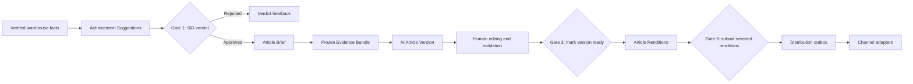
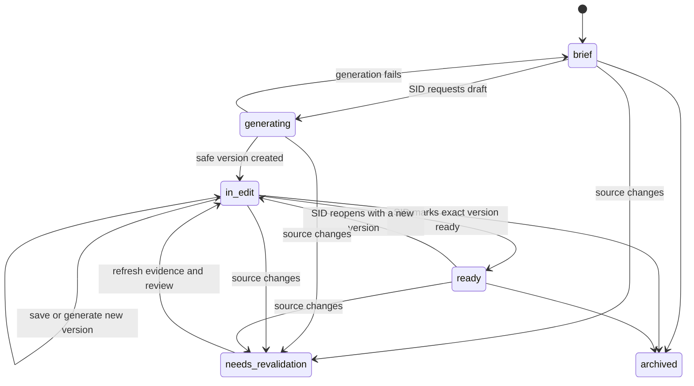
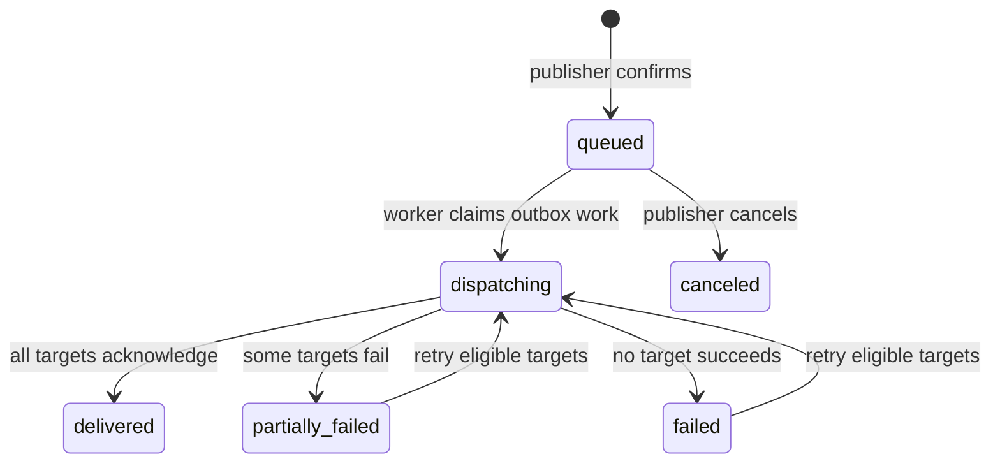

# Editorial Article Workflow

Status: **Accepted for prototype implementation — July 27, 2026**

This document defines the Release 1 contract for turning approved Achievement
Suggestions into evidence-bound Articles, editing them with human oversight, and
submitting channel-specific renditions through a durable distribution pipeline.

It applies the Deterministic-facts principle defined in root `CONTEXT.md` to
long-form editorial writing. The warehouse computes facts; AI may organize and
phrase them; humans decide what becomes ready and what is submitted.

## Goals

- Give the SID a governed path from an approved Achievement Suggestion to an Article.
- Make every AI-authored factual claim traceable to a frozen Evidence Bundle.
- Preserve AI and human editorial work as append-only Article Versions.
- Resolve editorial rules through reproducible, versioned Style Guides.
- Require distinct human actions for editorial readiness and external submission.
- Support multiple channels without coupling the canonical Article to one platform.

## Non-goals

- Autonomous publishing or model-selected communication channels.
- Free-form model research, web browsing, quote generation, or fact calculation.
- Replacing the Athletic Data Warehouse with a separate editorial fact store.
- Building the public newsletter microsite described in issue #1.
- Supporting multi-game, season-summary, or feature-profile Articles in Release 1.

## Release 1 boundary

Release 1 is internal-SID-first under ADR-006:

- women's basketball
- one game per Article
- one or more approved Achievement Suggestions from that game
- website, email, and social Article Renditions
- HTML, plain-text, DOCX, and JSON export
- generic signed-webhook delivery through a disabled-by-default Channel Profile

The first live institutional channel is selected in issue #151 after the generic
contract, per-user authorization, sandbox delivery, and security review are complete.

## Roles and permissions

One person may hold more than one role, but every privileged action records an
individual identity.

| Role | Allowed actions |
| --- | --- |
| `sid_editor` | Create Article Briefs, generate drafts, edit, resolve warnings, and mark an Article Version ready |
| `publisher` | Create and preview renditions, confirm Distribution Submissions, retry eligible failures, and cancel queued work |
| `style_steward` | Create successor Style Guide versions, preview resolution, activate, and retire versions |
| `channel_administrator` | Configure Channel Profile metadata and secret references; cannot read secret values through the app |

The shared prototype account is acceptable only for local evaluation. Before any
nonlocal Channel Profile is enabled, the application must provide per-user identity
and server-enforced role checks. UI visibility alone is not authorization.

## End-to-end workflow and human gates



1. **Verdict gate** — only approved Achievement Suggestions may enter an Article
   Brief. Approval remains an editorial signal and never changes warehouse facts.
2. **Ready gate** — an authenticated `sid_editor` selects one immutable Article
   Version after resolving all blocking fact and style findings.
3. **Submission gate** — an authenticated `publisher` previews exact rendition
   payloads and explicitly selects targets before durable outbox work is created.

No AI task may approve an Achievement Suggestion, mark a version ready, select a
channel, or create a Distribution Submission.

## Article state machine



`Article.status` describes editorial state. Generation and distribution use separate
state machines so a failed external delivery cannot rewrite editorial readiness.

An Article in `needs_revalidation` cannot generate, become ready, create renditions,
or be submitted. Delivered records remain immutable; revalidation governs only new
versions and new submissions.

### Source evidence revalidation

Achievement redetection and explicit verdict changes compare each active Article's
latest frozen Evidence Bundle with the current warehouse evidence. The comparison
uses material values rather than transient fetch identifiers. A repeated fetch with
the same facts, game inputs, source content hash, Coverage Window, and valid approval
preserves the Article state and Evidence Bundle identity.

Material changes append an `ArticleEvidenceRevalidation` record containing typed,
human-readable frozen and current values. The detector covers:

- game identity, result, and other Evidence Bundle inputs
- Achievement Suggestion facts, phrasing, and disappearance
- source system, type, URL, and content hash
- Coverage Window scope, completeness, and limitations
- current SID approval and its deterministic fact hash

Detection moves the Article to `needs_revalidation`, clears any convenience pointer
to a ready version, records a reopen decision, and fails queued or running generation
work before it can persist a version. Existing Evidence Bundles, Article Versions,
readiness decisions, and delivered history remain unchanged.

The Article workspace shows the frozen and current values and links to the Achievement
review queue. After every current suggestion is re-approved, the SID uses
`POST /api/v1/articles/{article_id}/revalidation/refresh`. The refresh appends a new
Evidence Bundle and, when copy already exists, a child human Article Version bound to
that bundle. Deterministic validation runs against the copied checkpoint so changed
numbers or claims become blocking findings for human correction. A brief without a
draft returns to `brief`; an Article with a prior version returns to `in_edit`.

## Generation job state machine

```text
queued -> running -> succeeded
                  -> failed
```

Generation jobs are durable database records, not process-local background-task
dictionaries. A worker may reclaim abandoned `running` work using an explicit lease
and attempt record. A failed or unsafe response creates no partial Article Version.

The Release 1 implementation queues jobs through
`POST /api/v1/articles/{article_id}/generation-jobs` and exposes durable status through
`GET /api/v1/articles/{article_id}/generation-jobs/{job_id}`. The backend worker claims
the oldest eligible job, records an attempt and lease before contacting the provider,
and reclaims expired work after restart. Provider failures and deterministic
validation failures return the Article to `brief` so the SID can retry without
recreating its Evidence Bundle.

## Distribution state machine



Every transition is server-validated. A retry reuses the original stable idempotency
key for each target and appends a Distribution Attempt; it does not create a second
logical submission.

## Article Brief and Evidence Bundle contract

Creating an Article Brief is an authenticated human action. Release 1 requires all
selected Achievement Suggestions to be:

- approved
- associated with the same game
- backed by a known source snapshot
- within a complete or explicitly partial Coverage Window
- unchanged since the recorded Verdict

The Evidence Bundle is a canonical, immutable JSON document plus a SHA-256 hash. It
contains only identifiers and display-ready facts the writer is permitted to use:

- game identity, date, teams, final score, result, and authoritative source
- selected Achievement Suggestions and reviewer metadata
- player and team facts intentionally selected for the Article
- applicable Coverage Windows and exact claim-scope wording
- source snapshot identifiers, URLs, hashes, and retrieval metadata
- deterministic narrative facts, such as selected scoring events, when available

The Evidence Bundle is not an open-ended serialization of the database or raw HTML.
The writer cannot query arbitrary tables, browse the web, or fetch source URLs.

## Writer output and factual validation

The writer returns a strict structured Article payload. Each factual block identifies
one or more Evidence Bundle item IDs. Validation occurs before persistence:

- every evidence ID exists in the bundle
- every numeral is supplied by referenced evidence
- player, team, opponent, and competition names match allowed entities
- record and comparative language matches an approved Achievement Suggestion
- required Coverage Window qualifiers remain present
- quotes, injuries, attendance, weather, and other unsupported fact classes are absent
- blocking deterministic Style Guide rules pass

The validator rejects the complete response on any blocking failure. Model-reported
confidence cannot override deterministic validation.

The seeded prototype Style Guide is an immutable shared-athletics version. It applies
headline length, unsupported-fact-class, measured-language, and punctuation rules
until issue #148 adds the maintainer workflow for scoped successor versions.

A human editor may add a fact not present in the Evidence Bundle only by recording a
source reference and an explicit verification attestation. The added fact is marked
`human_verified`, remains visible in the version audit data, and is never treated as a
warehouse-computed fact. A version cannot become ready while an added factual claim
lacks that source and attestation.

## Article Versions

Article Versions are append-only checkpoints. Each stores:

- Article and parent-version identifiers
- headline, body, and structured factual-block metadata
- origin: `ai` or `human`
- human author or model and provider metadata
- Evidence Bundle identifier and hash
- resolved Style Guide version identifiers and hash
- prompt/renderer version and output hash where applicable
- validation findings, acknowledged warnings, and human-added-fact attestations
- creation time

Saving a human edit requires `base_version_id`. If another editor has since saved a
version, the API rejects the stale save and preserves both editors' work for explicit
reconciliation.

The Article points to a selected ready version for convenient reads, but that pointer
does not make the underlying version mutable.

The Release 1 implementation exposes this contract through:

- `GET /api/v1/articles` for the SID queue with owner, latest, and ready state
- `GET /api/v1/articles/{article_id}/versions` for immutable history
- `POST /api/v1/articles/{article_id}/versions` for optimistic-concurrency human saves
- `POST /api/v1/articles/{article_id}/versions/{version_id}/ready` for the human gate
- `POST /api/v1/articles/{article_id}/revalidation/refresh` for deliberate refresh

The Article workspace keeps evidence adjacent to the copy, supports original/current,
side-by-side, and inline-diff review, and requires a written reason for every warning
before readiness. Requesting an AI revision adds editor instructions and the selected
base version to the bounded writer input but does not expand the Evidence Bundle.

## Style Guide resolution

Style Guides are immutable versions. Active rules resolve in this order, with later
scopes refining earlier scopes:

1. shared athletics
2. sport
3. article type
4. channel, for Article Renditions only

Rules have stable keys, categories, severity (`error`, `warning`, or `guidance`), and
an enforcement type:

- deterministic lint
- required or forbidden terminology
- length or structure constraint
- writer instruction

Conflicting active rules with the same stable key are rejected unless the more
specific rule explicitly declares an override. Activating a successor version never
changes the Style Guide snapshot stored on an existing Article Version or rendition.

An error blocks persistence or readiness as defined by the rule. A warning requires
resolution or a recorded human reason. Guidance is visible but nonblocking.

## Article Renditions

An Article Rendition is derived from one ready Article Version for one Channel Profile.
It stores the source version, Evidence Bundle, resolved channel Style Guide, renderer
version, exact payload, creator, and timestamp.

The canonical Article is never edited to satisfy a channel. Any AI-assisted shortening
or restructuring remains within the same Evidence Bundle and passes the same factual
validators. Exports preview content but do not create a Distribution Submission.

## Distribution outbox and channel contract

The publisher's confirmation creates the Distribution Submission, selected targets,
and outbox records in one database transaction. Channel adapters receive an immutable
rendition payload and an idempotency key. They return a normalized receipt or a
classified failure.

Channel Profiles store capabilities, destination identifiers, enabled state, and a
secret reference. Secret values live in approved environment-backed secret storage;
they are never stored in application rows, logs, receipts, or Article payloads.

The first live channel should be chosen using these criteria:

- identified institutional owner and support contact
- sandbox or test destination
- documented authentication and credential-rotation procedure
- idempotent create/update semantics or a safe deduplication key
- delivery receipt or externally resolvable content identifier
- rate-limit and retry documentation
- reversible production enablement and rollback
- approved data classification and security review

Until issue #151 records a selected channel and go-live approval, nonlocal Channel
Profiles remain disabled.

## Data classification and audit

- Warehouse game and statistical facts are normally **Public**.
- Article Briefs, drafts, editor notes, warnings, and delivery configuration are
  **Internal** until an authorized publisher submits them.
- Individual reviewer and publisher identities are **Internal** audit data.
- Channel credentials and signing secrets are **Restricted** and remain outside the
  application database.

Audit records are append-only for Verdict events, Article Versions, evidence
revalidations, readiness actions, warning acknowledgements, Distribution Submissions,
and Distribution Attempts.
Application logs may reference their identifiers but must not duplicate full content,
secret values, or provider payloads.

## Legacy GeneratedContent disposition

The current `GeneratedContent` record and `POST /games/{game_id}/generate` path do not
provide approved-suggestion gating, frozen evidence, append-only human versions,
versioned Style Guides, or deterministic claim validation.

They remain available during implementation for comparison only. After issues #146
and #149 provide editor and export parity, issue #152 will:

- remove the active generation control
- prevent creation of new legacy rows
- retain existing rows as clearly labeled, read-only historical drafts
- link users to the Article Brief workflow
- avoid automatically converting any legacy draft into an approved Article Version

## Review record

Reviewer: **ProfessorPolymorphic, temporary SID approver**

Review date: **July 27, 2026**

Decision: **Accepted for prototype implementation**

Notes: **The project is being prototyped in advance of an athletics feedback
session. These decisions govern prototype implementation and must be revisited with
athletics before production channel enablement.**

This approval changes ADR-010 through ADR-013 from Proposed to Accepted and unblocks
issue #144. Any material change to the human gates, factual boundary, style precedence,
or delivery contract requires an ADR update or successor.
